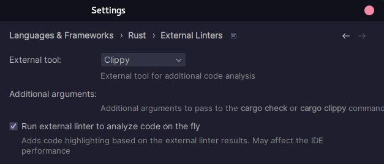

# Velkommen til Rust-workshop!
 ― Workshop for å lære programmeringsspråket Rust gjennom sjakk ―

<span style="justify-content: space-between; display: flex"><span>
    <strong>Er du klar for Rust-workshop? Hopp til intro-siden!</strong>
</span> <span>
    [Intro →](./doc/intro.md)
</span></span>

___


# Kom i gang
[Rust-boka](https://doc.rust-lang.org/book/) vil være en av dine beste venner i løpet av dette kurset. Start med å kjøre
installasjonskommandoen den foreslår:
```bash
curl --proto '=https' --tlsv1.3 https://sh.rustup.rs -sSf | sh
```

## Rust plugin i IntelliJ
Dersom du bruker IntelliJ anbefales det sterkt å installere Rust-utvidelsen, og konfigure den slik:




Det kan også være kjekt å ha tilgang til _avlusing_ (eng. *debugging*) om du jobber i IntelliJ. Kjør i så fall
```bash
sudo dnf install llvm-toolset
```
og last ned utvidelsen *Native Debugging Support* fra IntelliJ-markedsplassen.

## Kjøre programmet

* `cargo run` for å kjøre programmet i oppgaven du jobber med
* `cargo run finished` for å gjøre det ferdige sjakk-spillet
* `cargo test` for å kjøre alle tester
* `cargo test task_0` kjører tester for en spesifikk oppgave (erstatt 0 med din oppgave)

Oppsettet for workshopen er beskrevet i [doc/workshop.md](./doc/workshop.md). Der finner du en full oversikt med alle
_run_- og _test_-kommandoene, som kan kjøres rett fra _.md_-filen i IntelliJ.