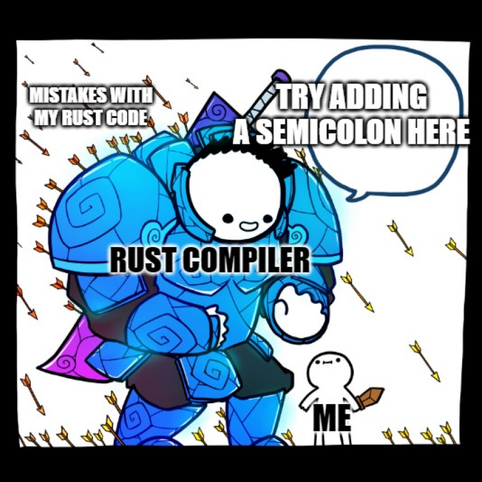

# Introduksjon

    [← README.md](../README.md)
 
    [Teorioversikt →](./teori.md)

___
 
## Hvorfor er så mange interesserte i Rust?
Rust har i syv år på rad blitt kåret til det høyest elskede programmeringsspråket blant brukerne på Stack Overflow.
I 2022 var det 87 % av utviklere som da at de ville fortsette å bruke det.

Les gjerne:
* [Why the developers who use Rust love it so much](https://stackoverflow.blog/2020/06/05/why-the-developers-who-use-rust-love-it-so-much/)
* [7 Reasons to Use Rust for Your Next Development Project](https://geekflare.com/reasons-to-use-rust/)

## Hva er greia med Rust?
Rust er et multi-paradigmespråk, spesielt egnet for oppgaver som krever høy ytelse, pålitelighet og parallelitet. Det
kompilerer til binærkode, og brukes kanskje i størst grad for systemutvikling, det en ofte kan bruke C og  C++ til. Rust
kan også kompilere til [WebAssembly](https://webassembly.org/), som gjør det mulig å dra nytte av den høye ytelsen også
i webapplikasjoner.

Rust er spesielt kjent for:

 * **Minnesikkerhet**: Rust sikrer minnesikkerhet ved kompileringstid. Det gjør den ved å bruke en variabels _scope_.

> Bruker Rust _garbage collector_?
> 
> Nei! Rust frigjør minne knyttet til en variabel når variabelen går ut av scope.Dermed kan Rust avgjøre ved
> kompileringstid når minnet kan frigjøres. Dette er i motsetning til en _garbage collector_, som ofte går ut på å
> kjøre en parallell prosess som leter etter minne som ingen variabler refererer til, og frigjør dette.
> 
> Dermed har Rust like høy ytelse som C med hensyn til minnet, men uten fallgruvene med minnelekkasjer og nullpekerfeil,
> og er like enkelt med hensyn til dynamisk allokering som Kotlin, men uten å miste ytelse til _garbage collecting_.

 * **Tråd-sikkerhet**: På grunn av hvordan Rust håndterer referanser til minne (gjennom konseptene _låning_ og _flytting_,
som håndheves av _lånesystemet_ (eng. _borrow checker_) og variablers levetid, er Rust garantert å være tråd-sikkert.

 * **Cargo**: Litt som _npm_ + _ESlint_ + _prettier_ + _Jest_. Tar seg av å installere pakker, håndtere avhengigheter,
lintsjekke koden din, kjøre tester. _Batterier inkludert_, med andre ord.

 * **En hyggelig kompilator**: Rust-kompilatoren er spesielt velskreven, og kan ofte fortelle deg nøyaktig hvor i koden
noe er feil, og kan foreslå hva du bør gjøre i steden.

>Kompileringssteget i Rust kan ofte oppfattes strengt, men gjennom å luke ut alle minnefeil i kompileringssteget, gjør
> det at tiden til _debugging_ kuttes drastisk ned. Feilmeldingene fra kompilatoren gjør dette til en hyggelig oppgave.

## Hva med å bruke Rust i SB1U?
### Kan vi?
En kan bli så ivrig på Rust at en fort leter etter bruksområder der det ikke nødvendigvis er behov.
Som Jonas spurte oss, _«Ni har hittat hammaren, men har ni en spik att slå i?»_

Rust er ikke først og fremst utviklet for å skrive webapplikasjoner, selv om dette er fullt mulig. Gjennom
_yew_-rammeverket er det faktisk også mulig å skrive frontend-kode. Rust ble opprinnelig startet av noen fra Mozilla,
og i dag er deler av Firefox og Linux-kjernen skrevet i Rust. Noen mener økosystemet rundt Rust er i dag ikke er spesielt
web-sentrert, mens andre mener Rust er knallbra for web (se artiklene lenket til under).

Likevel kan det være bruksområder hvor Rust er nyttig ― spesielt der ytelse er essensielt. Dette kan være i
kommandolinjeverktøy, byggeverktøy, og særlig om vi finner bruksområder for WebAssembly i teknologistakken vår.

Les gjerne:
 * [Rust is a hard way to make a web API](https://macwright.com/2021/01/15/rust.html)
 * [Are we web yet? Yes! And it's freaking fast!](https://www.arewewebyet.org/)

### Bør vi?
Selv om vi blir et stort antall utviklere i SB1U som er glade i Rust og har lyst til å bruke det, er det kostnader
knyttet til
 * å utvikle verktøy og rammeverk rundt kode i Rust som vi allerede har i andre språk
 * økosystemet rundt Rust er enda ikke så stort som rundt Java/Kotlin (eller JavaScript/TypeScript, forsåvidt), som gjør
det vanskeligere å få støtte og å rekruttere kompetanse

Gevinsten i Rust er dessuten vanskeligere å innhøste når vi har mange avhengigheter til eksterne tjenester og partnere
som har høyere responstid og lavere ytelse enn oss. Da er det andre flaskehalser som begrenser vår ytelse.

Det hadde vært veldig gøy, da. Kanskje du har flere tanker om Rust i SB1U etter å ha jobbet med denne workshopen?

Les gjerne:
 * [Performance Doesn't Matter...Until It Does.](https://www.youtube.com/watch?v=2Z4fZtSKlcE)

