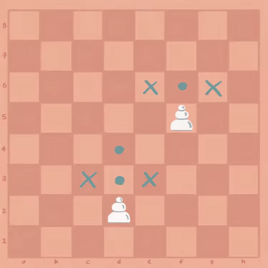

# Oppgave 4
> **Mål:** Implementere bondetrekk for _svart bonde_

> **Hvor skal jeg jobbe:** [piece/pawn.rs](piece/pawn.rs)

Denne oppgaven generaliserer vi trekkene for den hvite bonden slik vi også kan finne trekkene til den sorte bonden.

Du må utvide `get_moves()` metoden til å støtte dette. Se etter en `todo!()`. I koden finner du også kommentarer som 
beskriver hva ulike metoder gjør, og det står todo!() i metoden du skal implementere.

Du finner også hint i [hint.md](./hint.md).

## Bondens trekk
Bonden er den mest grunnleggende brikken i sjakk, men dens bevegelsesmønster kan være litt forvirrende til å begynne
med. Vi kommer til å fokusere på tre typer bondetrekk:
- Åpningstrekk: Bonden kan bevege seg ett eller to felt fremover
- Generell bevegelse: Bonden kan bevege seg ett felt fremover
- Angrepstrekk: Bonden kan slå brikker som befinner seg diagonalt foran bonden.

Bonden kan altså ikke gå til siden eller bakover, og den kan kun slå diagonalt. Se figuren under:



> **Merk!** I denne oppgaven forutsetter vi at vi allerede har implementert trekk for den hvite bonden, og utvider 
> koden til å støtte sorte bønder i tillegg.

## Eksempel
Svart bonde på `b5` skal kunne gå til `a4` eller `c4` dersom det står motstanderbrikker på `a4` og `c4`, og den kan 
generelt gå til `b4` hvis feltet er ledig (vanlig bevegelse fremover).

```rust
let pawn = Pawn::new(Color::Black, "b5".as_u8().unwrap());
let opponent_piece_positions = set!["a4", "c4"];
let legal_moves = set!["a4", "b4", "c4"];
assert_eq_set!(legal_moves, pawn.get_moves(&HashSet::from([pawn.position]), &opponent_piece_positions));
```

## Kjøring
```bash
cargo run 4
```
```bash
cargo test task_4
```

Se [hint.md](hint.md) for hint.